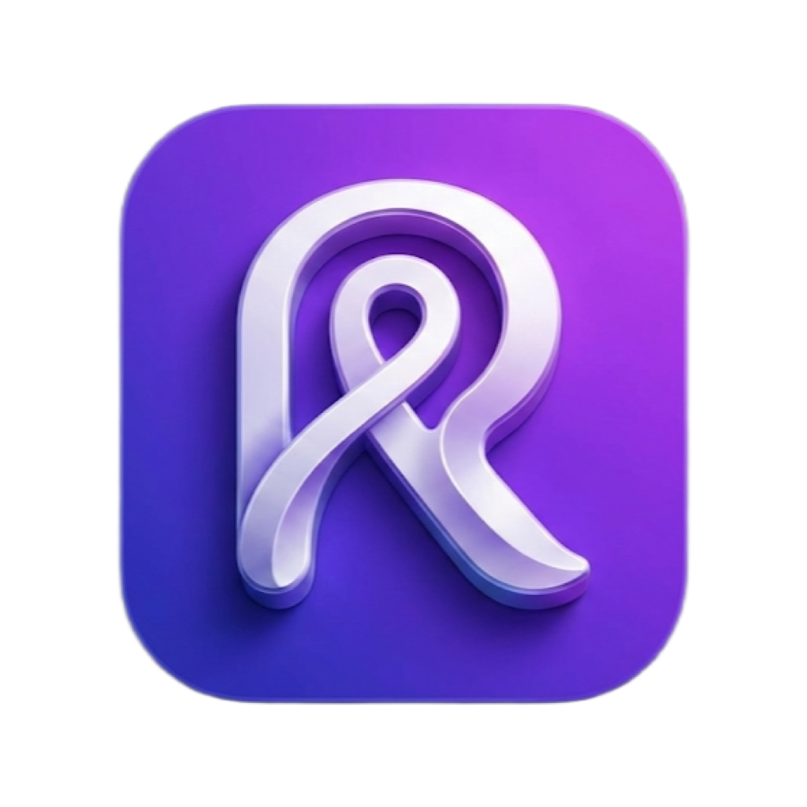

<div align="center">

  

  # Rido
  
  **Electrify Your Ride**
  
  [](https://flutter.dev)
  [](https://dart.dev)
  [](https://firebase.google.com)
  [](https://www.android.com)
  [](https://www.apple.com)

  <p>
    <b>Rido</b> is a cutting-edge mobile platform connecting riders with drivers for seamless on-demand transportation. 
    Built with love for <b>Dhamtari</b>, it focuses on community, safety, and sustainable travel.
  </p>

</div>

---

## ✨ Key Features

- **🚗 Ride Booking**: Easy, intuitive interface to book Cars, Bikes, Scooties, and Autos.
- **⚡ Real-time Tracking**: Live location updates for your ride.
- **🔒 Secure Payments**: Integrated digital wallets and safe transaction handling.
- **📍 Smart Location Search**: Google Places API integration with strict geo-fencing for service areas.
- **🎨 Premium UI/UX**: 
  - Beautiful **Dark Mode** support.
  - Smooth **Lottie Animations** for vehicle types.
  - Dynamic **Glassmorphism** effects and gradients.

## 🛠 Tech Stack

This project leverages a robust and modern technology stack to ensure performance and scalability.

| Category | Technologies |
|----------|--------------|
| **Core** | [Flutter](https://flutter.dev), [Dart](https://dart.dev) |
| **State Management** | [Riverpod](https://riverpod.dev) (v2.5) |
| **Backend** | [Firebase](https://firebase.google.com) (Auth, Firestore, Storage) |
| **Maps & Location** | [Google Maps Flutter](https://pub.dev/packages/google_maps_flutter), [Geolocator](https://pub.dev/packages/geolocator) |
| **UI Components** | [Shadcn Flutter](https://pub.dev/packages/shadcn_flutter), [Lucide Icons](https://lucide.dev) |
| **Architecture** | Clean Architecture (Features, Presentation, Data, Domain) |

## 🚀 Getting Started

Follow these steps to set up the project locally.

### Prerequisites

- [Flutter SDK](https://docs.flutter.dev/get-started/install) (3.19+)
- [Dart SDK](https://dart.dev/get-dart)
- [Android Studio](https://developer.android.com/studio) / [VS Code](https://code.visualstudio.com/)
- A **Google Cloud Project** with Maps SDK and Places API enabled.
- A **Firebase Project** configured for Android/iOS.

### Installation

1.  **Clone the repository**
    ```bash
    git clone https://github.com/your-username/rido.git
    cd rido
    ```

2.  **Install dependencies**
    ```bash
    flutter pub get
    ```

3.  **Run the app**
    ```bash
    flutter run
    ```

## 📂 Project Structure

```
lib/
├── core/            # Core utilities, theme, and constants
├── features/        # Feature-based architecture
│   ├── auth/        # Authentication (Phone Auth, Login)
│   ├── home/        # Home Tab, Banner, Vehicle Selection
│   ├── ride_booking/# Booking Flow, Estimation, Maps
│   └── ...
├── main.dart        # Application entry point
└── ...
```

## 🤝 Contributing

Contributions are welcome! Please feel free to submit a Pull Request.

1.  Fork the Project
2.  Create your Feature Branch (`git checkout -b feature/AmazingFeature`)
3.  Commit your Changes (`git commit -m 'Add some AmazingFeature'`)
4.  Push to the Branch (`git push origin feature/AmazingFeature`)
5.  Open a Pull Request

---

<div align="center">
  <small>Built with ❤️ by Kafil for Dhamtari</small>
</div>
